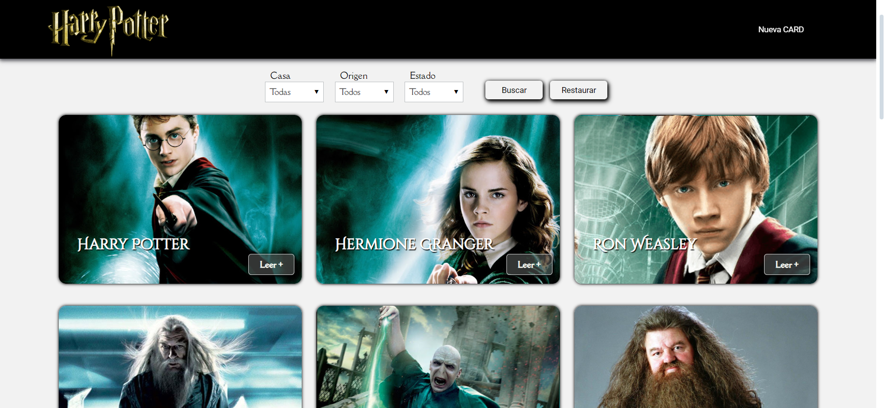
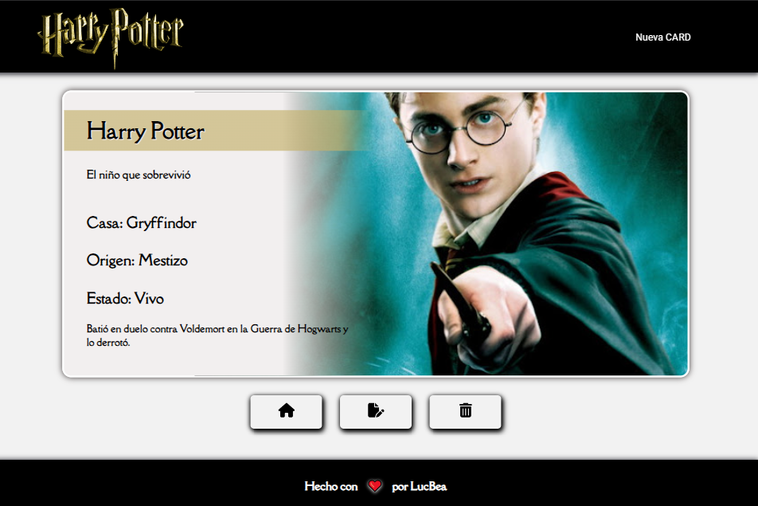
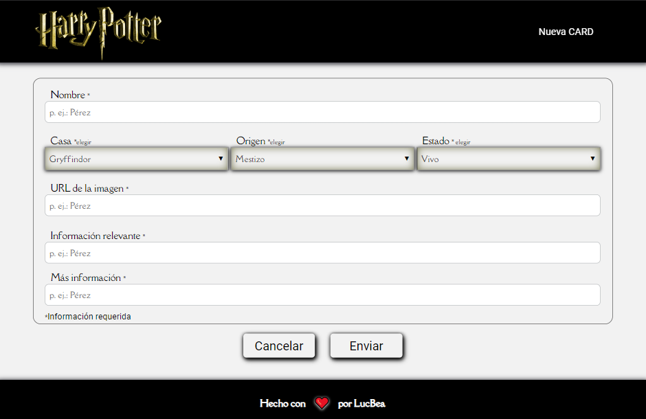
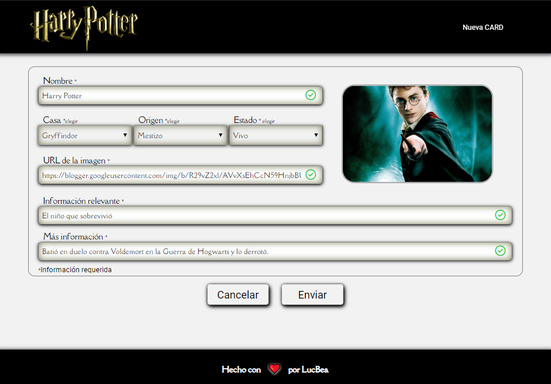
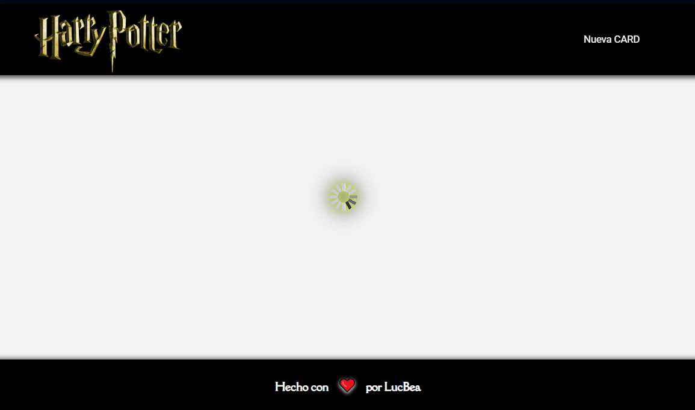
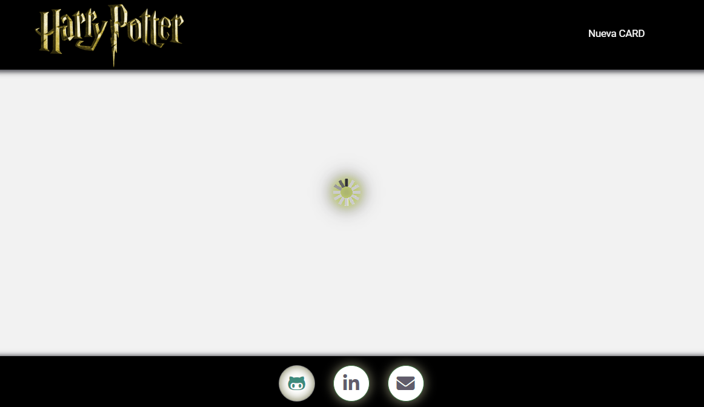

___
# ***Hola, soy Lucía Ferrer 👋!***
___

### Una apasionada de la programación Frontend   ♥
---

    En este trabajo se desarrollo el tema de asincronismo, y los primeros 
    aprendizajes sobre la manera de vincular el frontend con bases de datos.

---
### Tecnologías que usé en mi proyecto

Este trabajo fue desarrollado utilizando las siguientes tecnologías:  

|   |   |  |
| :---: | :---: | :---: |
|Lenguaje de marcado de hipertexto. Consiste en marcas basado en etiquetas que otorgan la estructura básica de la app.| Preprocesador que nos permite generar, de manera automática, hojas de estilo, añadiéndoles características que no tiene CSS. | Lenguaje de programación. Otorga interactividad a las distintas secciones que conforman la app.|

 

### 

[¡Haz clic aquí para explorar el proyecto en tu navegador!](https://lucbea.github.io/Harry_Potter/)
---

##### Espero que lo disfrutes, como lo hice yo cuando lo programé!
---
### **Imágenes de mi proyecto**

| Inicio - Muestra las cards |
|    :---:  |
||

 

| Leer +   -   Presentación de una card |
|    :---:  |
||

 

| Nueva Card |
|    :---:  |
||

 

| Editar Card |
|    :---:  |
||

 

|    FOOTER    | FOOTER Hover |
|    :---:  |   :---:  |
|| |

---
### **¡Contactame!**
¿Te gusta lo que ves? ¡Me encantaría saber tu opinión! No dudes en contactarme... 

--- 